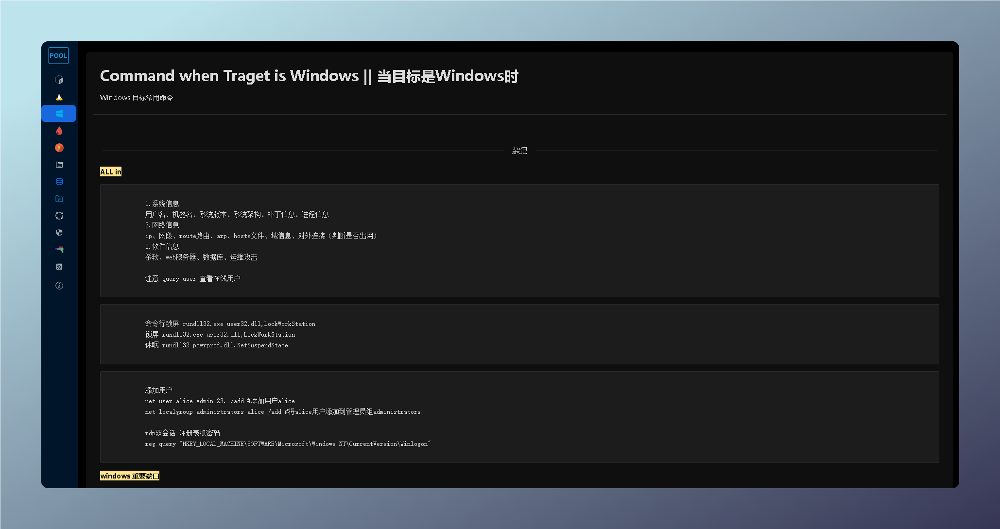

  <h1>🎈 P001's HackingNote 🎈</h1>

## P001_HackingNote 

[P001water 的个人笔记]  
基于 HackTools 二次开发  
React开发经验从0到根据需求基本重构整个项目 ：）   
开发于2024.5.2-5.5，记于2024.5.5;

个人浅薄积累，独乐乐不如众乐乐，随缘更新

### 当前功能

- 反弹shell命令生成 
- Liunx 目标渗透思路和命令
- Windows 目标渗透思路和命令
- Windows tasklist /svc 敏感进程识别
- Windows 和 Linux的敏感文件和目录 （完善ing）
- 重点系统后利用模块
- 数据库利用（完善ing）
- 文件下载快捷命令生成
- 常用代理转发工具命令
- 备忘录

## Preview

* 反弹shell命令生成 

* Liunx 目标渗透思路和命令

- Windows 目标渗透思路和命令

- Windows tasklist /svc 敏感进程识别

- 重点系统后利用模块 (暂未公开)
- 文件包含和不同系统常用目录
- 数据库利用模块
- 文件下载快捷命令生成
- 常用代理转发工具命令 
- 家中常备感冒药 - 备忘录 （啥都记一点）

